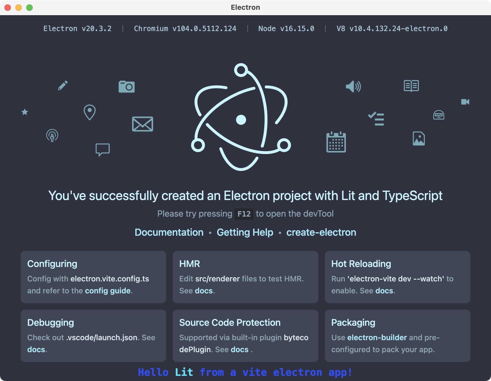

# An Electron application built with Vite and using Lit and Typescript

This project started as a clone of [electron-vite-boilerplate](https://github.com/alex8088/electron-vite-boilerplate/tree/master/src/renderer/src) by [alex8088](https://github.com/alex8088).

It was modified by [rudifa](https://github.com/rudifa), replacing the Vue dependencies and Vue components by Lit dependencies and Lit components.

You can use this modified project as a template for building your own Electron applications using the [Lit](https://lit.dev/docs/) components.

It was tested only on a Mac, with `npm run dev` and `npm run build:mac`.

If you find any issues with this project, please report them.

If you build and run the project on the Windows or the Linux platform, please report the success (or failure).

